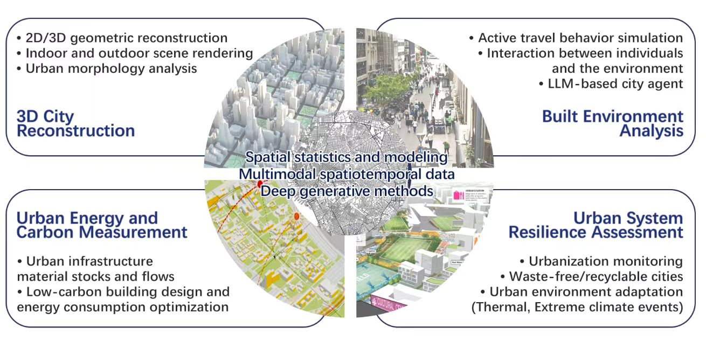

## About AI 4D City (AI4City) Lab

4D refers to 3D space plus time series modeling. As the type and density of the remote sensing data continue to grow exponentially, Dr. Wufan Zhao and his AI4City Lab aim to help pioneer computationally efficient AI-based processing and modeling strategies to solve complex and practical urban problems by integrating the multi- dimensional/modal characteristics of big earth observation data.

Our research is being conducted in two aspects. Firstly, a 3D city scene environment (including structured LoDs building models, infrastructures, land covers, etc.) reconstruction framework is being built on which any geo-referenced objects model at the instance level can be founded. Secondly, it is being studied how GIS, IoT data can be modeled in an nD way accordingly for specific application fields (e.g., built-environment, human dynamic, public health, urban climate, etc.)

Our research is both mission- and impact-oriented. We integrate data analytics and modeling technologies to achieve specific goals and contribute to the public good. Whether we are developing a physical product, analyzing trends at micro and macro levels, or creating new processes for optimal efficiencies, our work is always focused on sustainable development of the urban environment.

 
      

## Cooperative Institutions

- [EOS Department](https://www.itc.nl/about-itc/scientific-departments/earth-observation-science/), [ITC](https://www.itc.nl/), [Univerisy of Twente](https://www.utwente.nl/en/)
- [Geomatics Group](https://iiw.kuleuven.be/onderzoek/geomatics/home), [Faculty of Engineering Technology](https://iiw.kuleuven.be/english/index.html), [KU Leuven](https://www.kuleuven.be/english/kuleuven)
- [3D geoinformation Group](https://3d.bk.tudelft.nl/), [TU Delft](https://www.tudelft.nl/en/)
- [Digital Terrain Analysis Group](http://schools.njnu.edu.cn/geog/person/guoan-tang), [School of Geography](http://schools.njnu.edu.cn/geog/), [Nanjing Normal University](https://en.njnu.edu.cn/)
